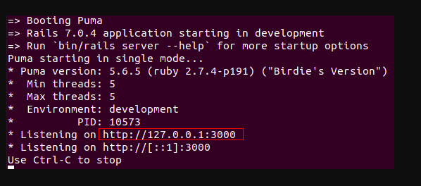
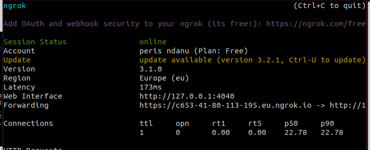
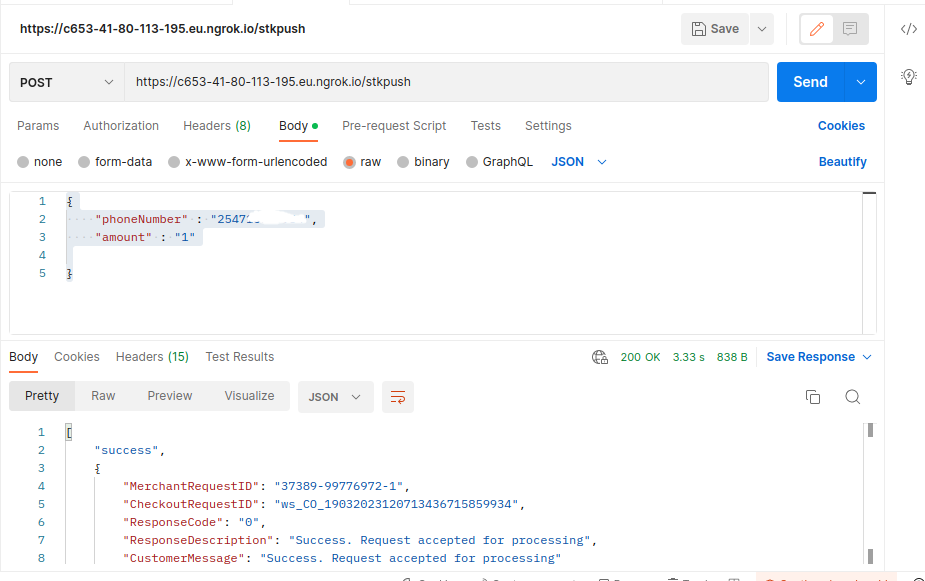
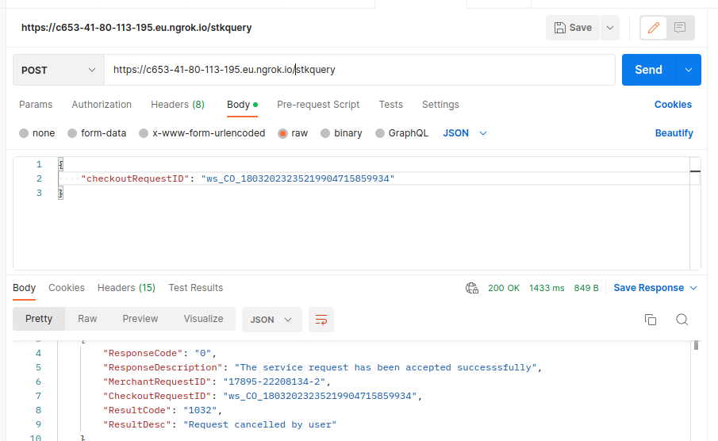

##                                         

#### Dependancies
gem 'rack-cors'
gem 'rest-client'

### Setup 
#### Daraja
- To get started head over to [daraja](https://developer.safaricom.co.ke/) and sign up for a developer account or login if you already have one.
- On my apps tab, create a new sandbox app and name it whatever you want, then tick all the check boxes and click on create app.
- You will be redirected to the app details page where you will find your consumer key and consumer secret.
- Save these somewhere safe as you will need them later.
- Navigate to the APIs tab and on M-pesa Express click on Simulate, on the input prompt select the app you just created.
- This will autopopulate some fields for you, you can leave them as they are.
- Scroll down and click on test credentials.
- Save your initiator password and passkey somewhere safe as you will need them later.

#### Ngrok
- Go to [ngrok](https://ngrok.com/) and sign up for a free account or login if you already have one.
- To install on ubuntu ``` sudo snap install ngrok ``` or download the zip file from the website and extract it.
- To connect your account to ngrok run ``` ngrok authtoken <your authtoken> ``` and replace <your authtoken> with your authtoken.

#### GIT
- git clone https://github.com/mimipeshy/mpesa_ruby.git
- Install the needed bundles using 

```
 bundle install
```
- Inside the config folder create a file called local_env.yml and add the following variables .
```
 local_env.yml

   MPESA_CONSUMER_KEY: '<your consumer key>'
    MPESA_CONSUMER_SECRET: '<your consumer secret>'
    MPESA_PASSKEY: '<your passkey>'
    MPESA_SHORTCODE: '174379'
    MPESA_INITIATOR_NAME: 'testapi'
    MPESA_INITIATOR_PASSWORD: '<your initiator password>'
    CALLBACK_URL: '< your ngrok url>'
    REGISTER_URL: "https://sandbox.safaricom.co.ke/mpesa/c2b/v1/registerurl"
``` 
- ** Note about the CALLBACK_URL **

To get you callback url first run your rails server rails s and copy the url from the terminal.
Then navigate to a new terminal and run ngrok http <port number> and replace with the port number from your rails server.
This will generate a url that you can use as your callback url.



- In my case above ngrok http://127.0.0.1:3000 or ngrok http 3000 the url generated was https://c653-41-80-113-195.eu.ngrok.io



- **Note** that the url generated by ngrok changes every time you run it, so you will need to update your local_env.yml file with the new url every time you run ngrok.
-  Remember to add your local_env.yml file to your .gitignore file.


### Usage
#### stkpush query
- Start your rails server with 
```
 rails s
```
- Fire up ngrok with 
```
 ngrok http http://127.0.0.1:3000
```
- Open postman and make a post request to your ngrok url with the following parameters.
```json
{
    "phoneNumber": "2547xxxxxxxx",
    "amount": "1"
}
```
- The request sents an STK push to the phone number provided.
- Your response should look like this.
```json
{
    "MerchantRequestID": "xxxx-xxxx-xxxx-xxxx",
    "CheckoutRequestID": "ws_CO_XXXXXXXXXXXXXXXXXXXXXXXXX",
    "ResponseCode": "0",
    "ResponseDescription": "Success. Request accepted for processing",
    "CustomerMessage": "Success. Request accepted for processing"
}
```

- Save the CheckoutRequestID for the next step.


 
## stkquery
- We can use the mpesa query to check if the payment was successful or not.
- Open postman and make a post request to your ngrok url with the following parameters.
```json
{
    "checkoutRequestID": "ws_CO_XXXXXXXXXXXXXXXXXXXXXXXXX"
}
```
- Your response should look like this.
```json
[
    "success",
    {
        "ResponseCode": "0",
        "ResponseDescription": "The service request has been accepted successsfully",
        "MerchantRequestID": "8491-75014543-2",
        "CheckoutRequestID": "ws_CO_12122022094855872768372439",
        "ResultCode": "1032",
        "ResultDesc": "Request cancelled by user"
    }
]
```
- You can use the ResultCode to check if the payment was successful or not.



That's it for this tutorial. I hope you found it helpful. If you have any questions, feel free to reach out to me on email: perisndanu@gmail.com.
THANK YOU!


